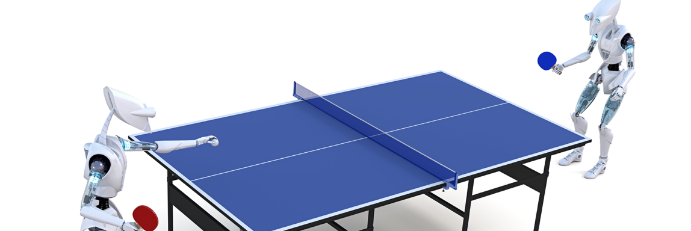

# Deep Reinforcement Learning nanodegree (drlnd)

Repository for project hand-ins in the Deep Reinforcement Learning for Robotics nano-degree at [ND893 at Udacity](https://www.udacity.com/course/deep-reinforcement-learning-nanodegree--nd893)

This repo consists of the following projects:

## Project 1: Navigation
Leverage neural networks to train an agent to navigate a virtual world and collect as many yellow bananas as possible while avoiding blue bananas.

## Project 3: Continuous Control
Train a robotic arm to reach target locations. For an extra challenge, train a four-legged virtual creature to walk!

## Project 5: Collaboration and Competition
Train a pair of agents to play tennis. For an extra challenge, train a team of agents to play soccer!

