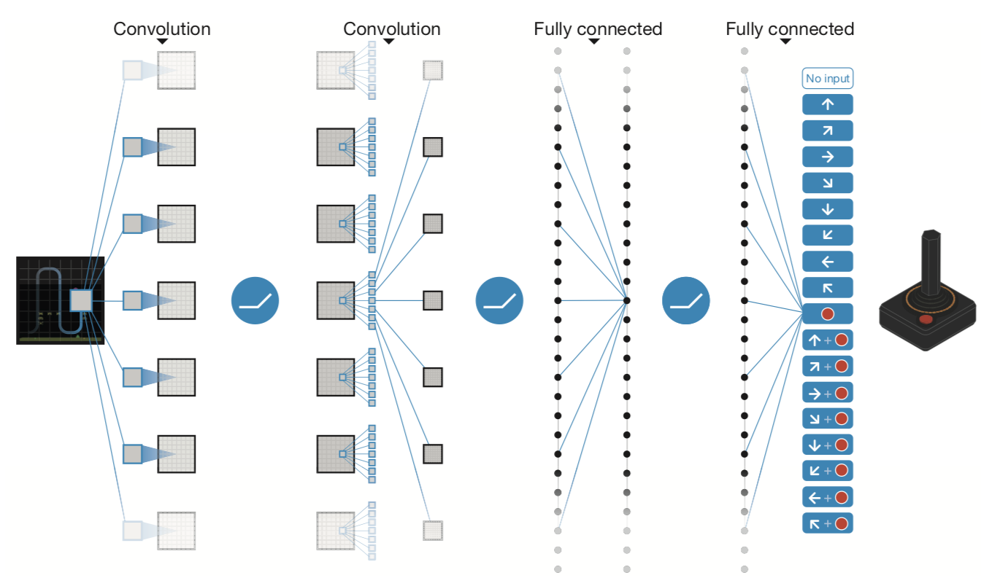
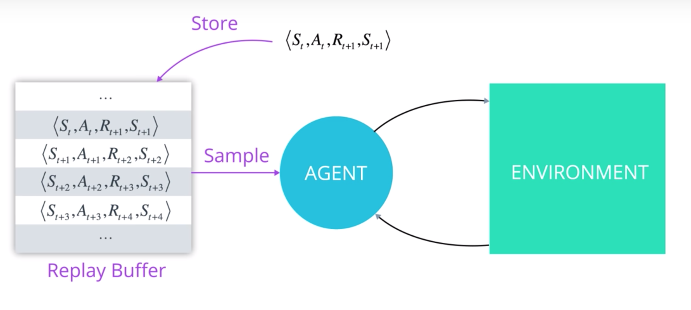

# Report Project 1: Navigation

For this project, an agent is trained to navigate (and collect bananas!) in a large, square world.

The project code is contained in three seperate files.

* `navigation_notebook.ipynb`: Notebook you test and run the code.
* `dqn_agent.py`: python class where the agent is defined.
* `model.py`: class where the Q-network is defined, which is used by dqn-agent.py.

The following headings are target to answer [these project rubric points for the report.](https://review.udacity.com/#!/rubrics/1889/view)

## Project Setup
A reward of +1 is provided for collecting a yellow banana, and a reward of -1 is provided for collecting a blue banana. Thus, the goal of your agent is to collect as many yellow bananas as possible while avoiding blue bananas.

The state space has 37 dimensions and contains the agent's velocity, along with ray-based perception of objects around agent's forward direction. Given this information, the agent has to learn how to best select actions. Four discrete actions are available, corresponding to:

* 0 - move forward.
* 1 - move backward.
* 2 - turn left.
* 3 - turn right.

The task is episodic, and in order to solve the environment, your agent must get an average score of +13 over 100 consecutive episodes.

## Learning Algoritm
This project uses reinforcement learning, where an agent learns from an environment, to figure out the best actions to take. It does so by making actions and perceive observations from the environment.

.

Reinforcement learning is often described as an agent trying to interact with an previously unknown environment, trying to maximize the overall or total reward. This learning algoritm is using deep neural network to approxmate the function that map the observations to the right actions to take in order to maximize this reward.

.

#### Deep Q-Network
In this project the agent learns from 37 dimmensions of the environment (as described above), and uses a deep neural network (as found in [model.py](model.py)) to map to the four avaiable actions.

The neural network uses three fully connected [linear layers](https://pytorch.org/docs/stable/nn.html#linear) with [rectified linear unit activation](https://pytorch.org/docs/stable/nn.html#torch.nn.functional.relu) between the fully connected hidden layers and returns an vector of action values from the third fully connected linear layer.

#### Agent
The agent is defined in [dqn_agent.py](dqn_agent.py), which uses the deep q-network.

#### Experience replay
Our agent uses experience [replay buffer](https://github.com/SigveMartin/drlnd/blob/22c0a477933d6c0e8b72c8ab45f74173025badd4/project_1_Navigation/dqn_agent.py#L120) as illustrated in the image below.

The agent interacts with the environment and collects experience tuples. These are stored in the replay buffer ([the agents memory](https://github.com/SigveMartin/drlnd/blob/22c0a477933d6c0e8b72c8ab45f74173025badd4/project_1_Navigation/dqn_agent.py#L41)) and later randomly sampled in order to help break the correlations between consecutive experiences and help stabilize the learning algoritm.

In our network we store experience for every step, and then learns (update the network) every fourth step.

#### Double DQN
In order to prevent overetimation of q-values this agent is equipped with two function approximations, or a double set of [q-networks (local and target)](https://github.com/SigveMartin/drlnd/blob/22c0a477933d6c0e8b72c8ab45f74173025badd4/project_1_Navigation/dqn_agent.py#L36).

In our implemention we get the maximum predicted Q values from the target model and the expected q-values from the local model and evaluate them. The [target model is updated](https://github.com/SigveMartin/drlnd/blob/22c0a477933d6c0e8b72c8ab45f74173025badd4/project_1_Navigation/dqn_agent.py#L106) by copying the weights from the local model into the target model, when learning from the experiences.

The local model is used to produce actions for a state when the agent acts. However, these two function approximators must agree on the best actions through the learning step on the Q-values.

In the long run this prevents the algoritm from propogating incidential high rewards that might be obtained by chance and don't reflect long-turn returns (ref. lesson 2.9 Udacity).

#### Hyperparameters for DQN
The hyperparameters for the agent is found and explained in the [dqn_agent.py](dqn_agent.py).

* BUFFER_SIZE = int(1e5) -
The replay buffer size. The amount of tuples that will be stored in memory.
* BATCH_SIZE = 64 -
The minibatch size; the minimum number of samples that need to be available in memory in order to start learning from it.
* GAMMA = 0.99 -
The discount factor; the value the agent puts on future rewards. If the value is one, the agent values future rewards just as much as the current reward.
* TAU = 1e-3 - The factor for soft update of target parameters, when copying over weights from local model.
* LR = 5e-4 -
The learning rate used to train the neural networks, by the [adam optimizer](https://github.com/SigveMartin/drlnd/blob/16a3234cefbdb55bfd5f9f9d84152fb2275f00ff/project_1_Navigation/dqn_agent.py#L39)
* UPDATE_EVERY = 4 -
The number of timesteps the agents performs before learning from experience stored in memory each step.

## Plot of Rewards

The project was trained on 1000 episodes. As the plot of rewards show below, it could have

As the plot shows, 600 episode had been sufficient as the score reached over 13 on average and that it didn't increase significantly after that.

## Ideas for future work

Now the network is learning from 37 parameters, having information such as its velocity, along with ray-based perception of objects around its forward direction. These are feed into fully connected linear layers, as described above, to estimate the actions.

An update, as described also in the optional challenge for this project, might be to learn directly from pixels. That requires another environment almost identical to the project environment, where the only difference is that the state is an 84 x 84 RGB image, corresponding to the agent's first-person view of the environment.

In addition it will require updating the network, as defined now in the model, to have a convolutional neural network as the DQN architecture as illustrated in the image below.

Here the convolutional layers learns from the pixel data and feeds into fully connected linear layers, and produces the action vector at the end (in this picture from an attari game). 
